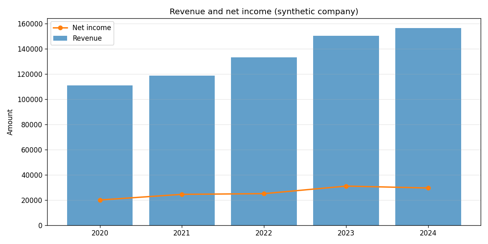
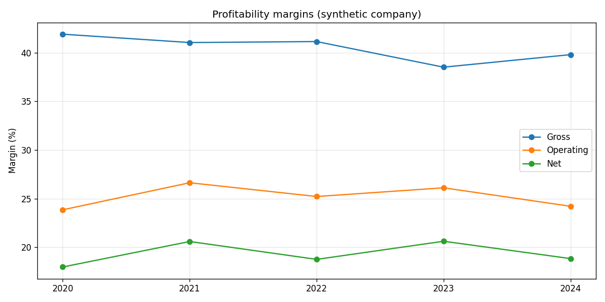
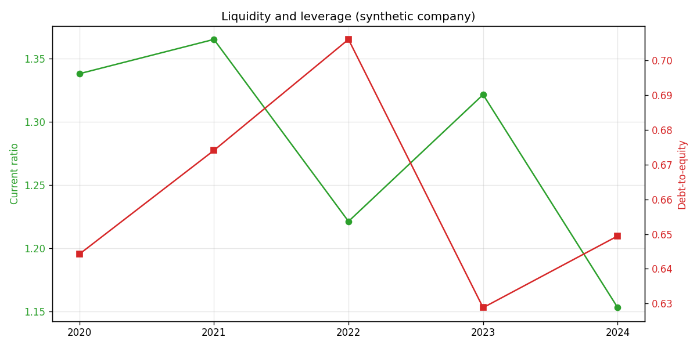

# Financial Statement Analysis

Point this at a public company and it reads the income statement, balance sheet,
and cash flow over several years, computes the ratios that actually matter, and
turns them into plain-language growth figures and risk flags. It is the work an
analyst does in the first hour with a new name, done in code.

It pulls real statements from Yahoo Finance through yfinance, and ships a
synthetic company so the tests and a first run need no network.

## Example output

These charts come from the bundled synthetic company, reproducible with
`python scripts/analyze_financials.py --synthetic --save-plots`. Point the tool
at a real ticker (`--ticker AAPL`) to run the same analysis on live data.

| Revenue and profit | Margins over time |
|--------------------|-------------------|
|  |  |



## What it computes

**Profitability:** gross, operating, and net margins; return on assets; return
on equity.

**Liquidity:** current ratio, quick ratio, cash ratio.

**Leverage and solvency:** debt-to-equity, debt-to-assets, interest coverage.

**Cash quality:** cash conversion (operating cash flow over net income) and free
cash flow margin. This pair is the lie detector. A company can report rising net
income while its cash conversion quietly falls, which is often the first sign the
earnings are lower quality than they look.

**Growth:** year-over-year change and multi-year CAGR for revenue, profit, and
free cash flow.

## Risk flags

The tool surfaces rule-of-thumb flags for the latest year: a current ratio below
1, debt-to-equity above 2, interest coverage below 3x, a negative net margin, a
net margin that compressed over the period, and negative free cash flow.

These are conversation starters, not verdicts. A grocery chain runs a current
ratio below 1 quite happily; a software company would be alarming at the same
level. The thresholds live in `config.yaml` so you can set them per industry.

## How it works

The key design choice: every ratio is computed from one canonical table indexed
by fiscal year, with a fixed set of line-item columns. The yfinance loader maps
that vendor's shifting row labels onto the canonical schema, so the analysis code
never breaks when a data source renames a field.

| Module        | Responsibility                                              |
|---------------|-------------------------------------------------------------|
| `data.py`     | Load statements (yfinance or synthetic) into the canonical table |
| `ratios.py`   | Profitability, liquidity, leverage, and cash-quality ratios |
| `trends.py`   | Year-over-year growth and CAGR                              |
| `analysis.py` | The readable summary and the risk flags                     |
| `plotting.py` | Revenue/profit, margin, and ratio charts                    |

## Getting started

```bash
git clone https://github.com/KelsonLam/financial-statement-analysis.git
cd financial-statement-analysis
pip install -r requirements.txt
python scripts/analyze_financials.py --ticker AAPL
```

Add `--save-plots` for charts, or `--synthetic` to run with no network.

## Being honest about the limits

- **Vendor data is imperfect.** Free statement data has gaps, restatements, and
  the occasional misclassified line. The loader is best-effort, and a missing
  field becomes a blank ratio rather than a wrong one.
- **Ratios need context.** Healthy ranges differ enormously across industries,
  and a single company in isolation tells you less than the same company against
  its peers and its own history. The trends matter more than any single number.
- **This is not the whole 10-K.** Footnotes, segment detail, off-balance-sheet
  items, and management commentary all matter and none of them are here. This is
  the quantitative skeleton, not the full read.

## Tests

```bash
pip install pytest
pytest
```

The suite checks the canonical schema, verifies the ratio math against
hand-computed values, confirms free cash flow is operating cash flow plus capex,
checks the CAGR formula, and confirms the risk flags fire on a weak company and
stay quiet on a healthy one.

## DuPont decomposition

Return on equity hides three different stories. `dupont.py` splits it into the
parts that drive it:

```
ROE = net margin x asset turnover x equity multiplier
```

```python
from finstmt.dupont import dupont
dupont(statements)   # net_margin, asset_turnover, equity_multiplier, roe by year
```

A high ROE driven mostly by the equity multiplier is a quieter way of saying the
return is borrowed.

## Project layout

```
financial-statement-analysis/
├── config.yaml
├── requirements.txt
├── scripts/
│   └── analyze_financials.py
├── src/finstmt/
│   ├── data.py
│   ├── ratios.py
│   ├── trends.py
│   ├── analysis.py
│   └── plotting.py
└── tests/
    └── test_ratios.py
```

## License

MIT. See [LICENSE](LICENSE).
